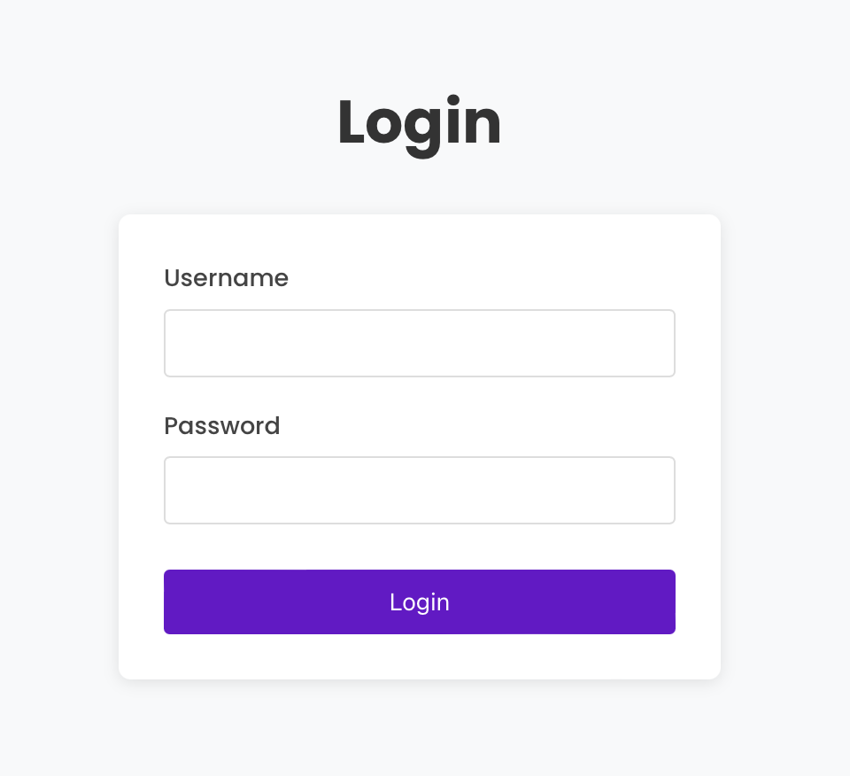

# Project Title

_Easy Eats_

---

## Team Members

- **Elena Hernandez** – Frontend Developer
- **Jairus Legion** – Backend Developer
- **Pegah Tajvidi** – Outside Collaborator

---

## Project Description

Easy Eats is a modern web application designed to help users discover and choose restaurants based on their preferences and needs. Our platform simplifies the dining decision-making process by providing personalized restaurant recommendations.

Key Features:
- Intuitive restaurant search and filtering
- User-friendly interface with modern design
- Restaurant details including cuisine type, and ratings

Target Audience:
- Individuals/groups having trouble deciding where to eat
- Tourists seeking local restaurant recommendations
- Anyone interested in exploring dining options in their area

---

## How to Run

Follow these steps to set up and run the project:

1. **Prerequisites:**
   - Node.js (v18 or higher)
   - npm (Node Package Manager)
   - Git
   - Java JDK 17 or higher
   - Maven or Gradle

2. **Frontend Setup:**
   ```bash
   # Clone the repository
   git clone [repository-url]
   
   # Navigate to the project directory
   cd restaurant-recommender
   
   # Install dependencies
   npm install
   
   # Start the development server
   npm start
   ```

3. **Backend Setup:**
   [ADD TO THIS]

The frontend application will be available at `http://localhost:3000` (or your configured port).
The backend API will be available at `http://localhost:8080` (EDIT AS NEEDED).

---

## Project Structure

### Backend (Java/Spring Boot)

The backend is built with Spring Boot and follows a layered architecture:

- **RestaurantCuisineApplication.java**: Main application class that serves as the entry point for the Spring Boot application.
- **Restaurants.java**: Entity class representing a restaurant in the database with properties like name, description, and address.
- **RestaurantRepository.java**: Repository interface that extends JpaRepository to provide CRUD operations for restaurant data.
- **RestaurantsService.java**: Service class containing business logic for restaurant operations, including filtering by tags.
- **RestaurantController.java**: REST controller that exposes API endpoints for retrieving restaurant information.

### Frontend (React)

The frontend is built with React and includes:

- **App.js**: Main application component that sets up routing and context providers.
- **RestaurantRecommender.js**: Component for searching and filtering restaurants.
- **RestaurantPage.js**: Component for displaying restaurant details and saved restaurants.
- **Restaurant.js** and **SavedRestaurant.js**: Classes representing restaurant data models.
- **RestaurantsContext.js**: Context provider for managing saved restaurants across components.
- **Login.js**: Component for user authentication.

---

## Features Implemented

Frontend:
- [x] Interactive restaurant search interface
- [x] Restaurant cards with detailed information
- [x] Filter and sort functionality

Backend:
- [x] API endpoints
- [x] Restaurant data management
- [x] Search and filtering logic

---

## Future Work
We managed to implement the different components of this application, but we did not have enough time to fully integrate them. However, we can expand upon this projuect in the future to ensure the application integrates the components in order to create a functioning restaurant recommender application. Some of the features we plan to improve include:

- [ ] Integrating frontend and backend
- [ ] User authentication and profiles
- [ ] Improve favorite restaurants feature
- [ ] Restaurant reviews and ratings
- [ ] Advanced search filters

---

## Known Issues

- Current API returns results from specific state
- Working on improving search result relevancy
- Fine-tuning mobile responsiveness for various screen sizes

---

## Screenshots

### Login Page


### Preferences Page


### Recommender Page


---

## Tech Stack

### Backend
- Java 17
- Spring Boot

### Frontend
- React
- React Router
- Context API for state management
- CSS for styling

---
